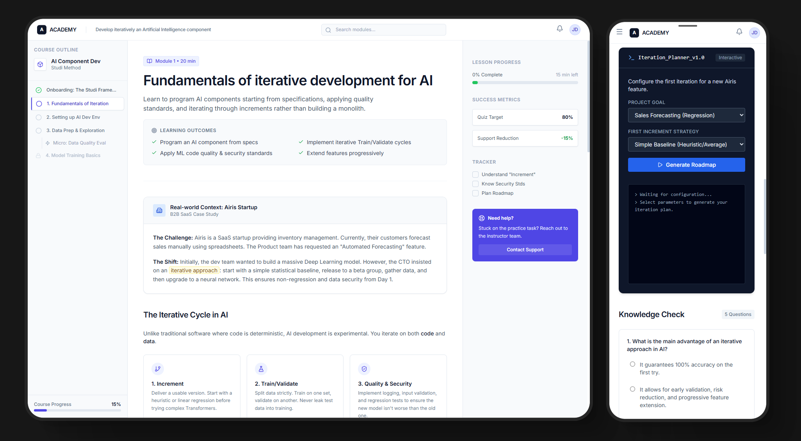

# AIkdemy
This repository presents a real-world instructional case study designed and developed during my experience as an Instructional Designer &amp; AI Author at Studi. It showcases a complete e-learning lesson focused on iterative development of Artificial Intelligence components, combining pedagogy, UX design, and technical best practices.

# Demo

https://johntrumanburbank-afk.github.io/aikdemy/

# ITERATIVE AI DEVELOPMENT

> AI is not a finished product.  
> It is a process of iteration, validation, and responsibility.

**Iterative AI Development** is an **interactive learning module** designed during my experience as an **Instructional Designer & AI Author at Studi**.

This repository presents a **complete e-learning lesson** dedicated to teaching **iterative development of Artificial Intelligence components**, combining:
- active pedagogy,
- business-oriented scenarios,
- educational UX design,
- and industry-aligned AI best practices.

It is conceived as both a **teaching resource** and a **reference case study** for AI education.

---

## 🌍 Pedagogical Vision

AI is often taught as a collection of models and algorithms.  
In real-world environments, AI development is instead:
- experimental,
- incremental,
- data-constrained,
- and inherently responsible.

This project promotes a clear mindset:

👉 **You don’t “build” AI once — you iterate it.**

The goal is to train learners to:
- think in **increments**,
- validate value early,
- reduce technical and product risk,
- align AI decisions with business objectives,
- avoid high-risk monolithic approaches.

---

## 🧩 Learning Content & Features

### 🔹 Structured and scenario-based lesson
- Core principles of iterative AI development
- Progressive learning path: baseline → improvement → optimization
- Realistic **B2B SaaS case study**

### 🔹 End-to-end practical case
- Fictional startup facing an AI-driven product need
- Translation of business requirements into technical goals
- Metric selection and evaluation strategy
- Trade-offs between simplicity, performance, and risk

### 🔹 Interaction & learner engagement
- Knowledge-check quizzes
- Guided exercises
- Iteration planning task
- Immediate feedback mechanisms

### 🔹 Educational UX
- Interface designed to reduce cognitive load
- Integrated microlearning blocks
- Clear visual hierarchy
- Autonomy-oriented learning experience

---

## 🏗️ Pedagogical Use Cases

- Introduction to AI / Machine Learning courses
- Data & AI training programs
- Teaching support for instructors
- AI education demonstrator
- Instructional Design & AI portfolio project

---

## ⚖️ Positioning & Scope

This project:
- ❌ is not an AI framework
- ❌ is not a production-grade model
- ❌ does not aim for maximum algorithmic performance

This project **is**:
- a **pedagogical tool**
- a **learning experience design case study**
- an **illustration of responsible AI practices**
- a **reference for iterative AI thinking**

---

## 🛠️ Stack & Concepts Covered

### 🧠 AI & Data
- Iterative AI development
- Baselines vs complex models
- Train / validation / test splits
- Non-regression principles
- Evaluation metrics (MSE, MAE, F1-score, Accuracy)
- Data quality and security fundamentals

### 🎓 Pedagogy & UX
- Instructional design
- Learning by doing
- Business-driven scenarios
- Microlearning
- Formative assessment

### 💻 Frontend & Interaction
- HTML / CSS
- Tailwind CSS
- JavaScript
- Interactive components
- Responsive educational interfaces

---

## 🚧 Project Status

✅ **Pedagogical version completed**  
🔧 Designed to evolve with:
- additional business cases
- domain-specific AI adaptations
- modular lesson extensions
- LMS integration possibilities

---

## 🤝 Contributions & Reuse

This repository can be used to:
- teach
- learn
- adapt
- discuss responsible AI practices

Feedback related to pedagogy, UX, or technical structure is welcome.  
👉 Feel free to open an issue or start a discussion.

---

## 📬 Author

Project designed by **Ismael Bernard**  
Instructional Designer · AI · UX  
Experience: **Studi — Instructional Designer & AI Author**

🔗 LinkedIn: https://www.linkedin.com/in/ismaelbernard/

---

> Teaching AI  
> is not about transferring models,  
> but about transmitting ways of thinking.

**Created by I. Bernard for Studi **
